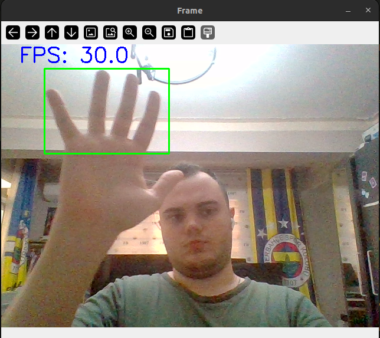

# 🟢 Real-Time Motion Detection (Classic CV)

Real-time **motion detection and bounding box extraction** using **classical computer vision techniques** (no deep learning).

This project detects motion from a webcam feed using **frame differencing**, cleans the motion mask with **morphological operations**, and draws a **single bounding box around the dominant moving object** in the scene.

---

## ✨ Features

- Real-time webcam inference  
- Motion detection via **frame differencing**  
- Noise reduction with **Gaussian blur**  
- Binary motion mask via **thresholding**  
- Mask cleanup using **morphological operations**  
- **Largest motion region selection** (single target)  
- Bounding box visualization  
- FPS overlay for performance monitoring  
- No ML / DL models — **pure OpenCV**

---

## 🧠 Core Idea

Motion is defined as **pixel-wise change between consecutive frames**.

### Pipeline Overview

1. Capture frame from webcam  
2. Convert to grayscale  
3. Apply Gaussian blur (noise reduction)  
4. Compute **absolute difference** with previous frame  
5. Threshold the difference image to obtain a motion mask  
6. Apply morphological operations (open → close → dilate)  
7. Extract contours  
8. Select **largest contour** as the primary moving object  
9. Draw bounding box  
10. Display FPS and output frame  

This approach is lightweight, fast, and ideal for understanding **classical motion detection fundamentals**.

---

## 📁 Project Structure

```
motion-detection/
│
├── src/
│   └── inference.py          # Main inference script
│
├── out/
│   └── test_inference.png    # Example output screenshot
│
├── requirements.txt
├── README.md
├── .gitignore
└── venv/                     # (ignored by git)
```

---

## 🖥️ Example Output

See the example screenshot below:

- Green bounding box → dominant moving object  
- Blue text → real-time FPS  



---

## 🚀 How to Run

### 1️⃣ Install dependencies

```bash
pip install -r requirements.txt
```

### 2️⃣ Run inference

```bash
python src/inference.py
```

### 3️⃣ Controls

- Press **q** to quit

---

## ⚙️ Key Parameters

You can tune these parameters inside `inference.py`:

| Parameter | Purpose |
|---------|--------|
| `thresh = 30` | Motion sensitivity |
| `kernel = (7, 7)` | Morphology strength |
| `MIN_AREA = 500` | Noise filtering |
| Gaussian blur `(5,5)` | Reduces sensor noise |

Adjust these values depending on:
- Lighting conditions  
- Camera quality  
- Desired motion sensitivity  

---

## ⚠️ Known Limitations

- Sensitive to sudden global illumination changes  
- Camera must remain mostly static  
- Very fast motion may cause motion trails  
- Designed for **single dominant motion target**  

These are inherent limitations of frame differencing methods.

---

## 🔧 Possible Improvements

- Bounding box smoothing (EMA)  
- Multi-object tracking  
- ROI-based motion filtering  
- 3-frame differencing  
- Background subtraction comparison (MOG2 / KNN)

---

## 🎯 Why This Project Matters

This project demonstrates:

- Understanding of **classical computer vision pipelines**  
- Ability to design and debug real-time systems  
- Strong fundamentals before deep learning  
- Clean engineering-oriented implementation  

A solid foundation before moving to:
- Optical flow  
- Object tracking  
- Deep learning–based detection  

---

## 🧑‍💻 Author

Built by **Emin Çağan Apaydın**

---

## 📄 License

This project is licensed under the MIT License - see the [LICENSE](LICENSE) file for details.